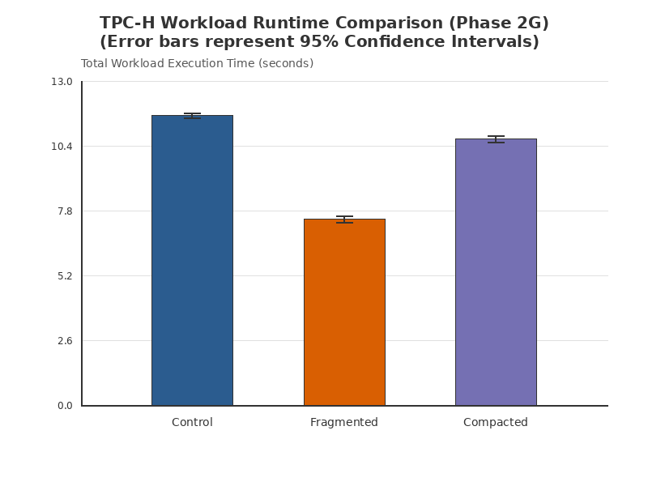
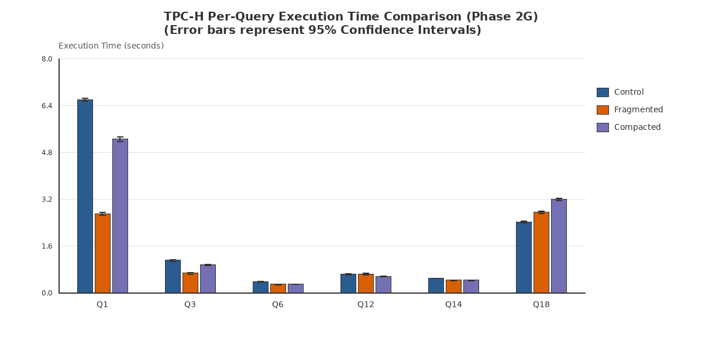
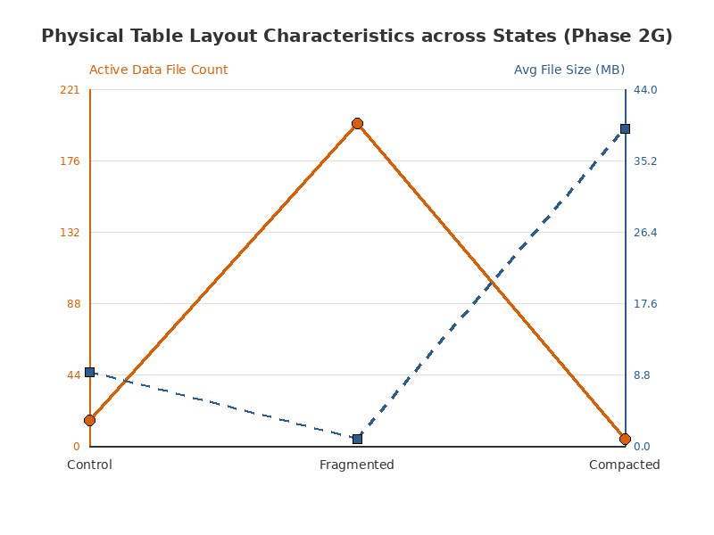
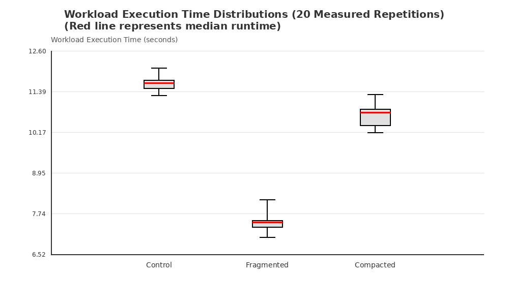

# Phase 2G: Validated Three-State Physical Layout Performance Experiment Report

This scientific report presents the findings of the Phase 2G experiment. It compares three different physical storage layouts of the `lineitem` Iceberg table using a statistically validated method that incorporates:
1. Run-order counterbalancing using all 6 possible execution-order permutations.
2. Separation of 2 warmup repetitions from 20 measured repetitions.
3. Realistic 64 MB target file compaction (State C) vs an intentional small-file stress treatment of 200 partitions with a 512 KB target (State B).
4. Dual physical-state validation (pre- and post-run layout metrics checks).
5. Explicit Student-t distribution 95% confidence intervals ($df=19$, $t=2.093$).
6. Paired state-difference analysis.
7. Noise-floor comparison relative to the empirically established Phase 2F environment-noise thresholds.

---

## 1. System Environment & Metadata

The experiment was conducted on a general-purpose workstation. System load and environment attributes were recorded prior to execution:

- **Hostname**: `sandbox`
- **OS Name**: `Linux 7.0.0-30-generic`
- **CPU Model**: `AMD Ryzen 7 5800H with Radeon Graphics`
- **Logical CPU Cores**: `16`
- **Total Physical Memory**: `14.96 GB`
- **Spark Version**: `3.3.4`
- **Iceberg Version**: `1.4.3`
- **Java Version**: `openjdk 11.0.24`
- **Warmup Policy**: 2 complete cycles (warmup repetitions 0 and 1)
- **Measured Repetitions**: 20 cycles (repetitions 2 to 21)
- **Workstation Status**: `Active/Shared workstation (1-min load avg: 5.73, CPU usage: 16.1%)`

---

## 2. Table Physical Layout Metrics (Pre-Benchmark)

The physical structure of each state was captured after execution of the preparation phase:

| table_name                                     | row_count | file_count | total_size_bytes | total_size_mb | avg_file_size_bytes | avg_file_size_mb | min_file_size_bytes | max_file_size_bytes | snapshot_count | current_snapshot_id |
| ---------------------------------------------- | --------- | ---------- | ---------------- | ------------- | ------------------- | ---------------- | ------------------- | ------------------- | -------------- | ------------------- |
| local.tpch.lineitem                            | 6001215   | 16         | 152325814        | 145.27        | 9520363.38          | 9.08             | 8702086             | 9672602             | 0              | -1                  |
| local.experiment.lineitem_validated_fragmented | 6001215   | 200        | 172510465        | 164.52        | 862552.32           | 0.82             | 860805              | 863955              | 0              | -1                  |
| local.experiment.lineitem_validated_compacted  | 6001215   | 4          | 164030025        | 156.43        | 41007506.25         | 39.11            | 1683180             | 54125934            | 0              | -1                  |

*Note: State B represents an intentional small-file stress treatment (not a production-realistic target layout) to evaluate the extreme performance penalty of metadata amplification and I/O fragmentation.*

---

## 3. Measured Descriptive Statistics (20 Repetitions)

The statistics below exclude the 2 warmup repetitions. Runtimes are in seconds. Confidence intervals are calculated as $\mu \pm t_{\alpha/2, n-1} \times SE$, where $t_{0.025, 19} = 2.093$:

| query          | state      | count | successes | failures | mean_seconds | median_seconds | min_seconds | max_seconds | stddev_seconds | cv_percent | standard_error | ci_95_lower | ci_95_upper |
| -------------- | ---------- | ----- | --------- | -------- | ------------ | -------------- | ----------- | ----------- | -------------- | ---------- | -------------- | ----------- | ----------- |
| Q1             | fragmented | 20    | 20        | 0        | 2.697        | 2.6658         | 2.6045      | 3.0443      | 0.1009         | 3.7398     | 0.0226         | 2.6498      | 2.7442      |
| Q3             | fragmented | 20    | 20        | 0        | 0.6629       | 0.6631         | 0.5603      | 0.8413      | 0.0635         | 9.5841     | 0.0142         | 0.6332      | 0.6927      |
| Q6             | fragmented | 20    | 20        | 0        | 0.2847       | 0.2803         | 0.2549      | 0.3278      | 0.0199         | 7.004      | 0.0045         | 0.2754      | 0.2941      |
| Q12            | fragmented | 20    | 20        | 0        | 0.6348       | 0.6357         | 0.5405      | 0.7624      | 0.0653         | 10.2789    | 0.0146         | 0.6043      | 0.6654      |
| Q14            | fragmented | 20    | 20        | 0        | 0.422        | 0.4165         | 0.3772      | 0.5429      | 0.0368         | 8.7223     | 0.0082         | 0.4048      | 0.4393      |
| Q18            | fragmented | 20    | 20        | 0        | 2.7563       | 2.7589         | 2.6155      | 2.9696      | 0.0914         | 3.3158     | 0.0204         | 2.7136      | 2.7991      |
| Q1             | control    | 20    | 20        | 0        | 6.5993       | 6.6054         | 6.4593      | 6.7926      | 0.0893         | 1.3536     | 0.02           | 6.5575      | 6.6411      |
| Q3             | control    | 20    | 20        | 0        | 1.1006       | 1.1017         | 1.0186      | 1.1973      | 0.0512         | 4.6485     | 0.0114         | 1.0767      | 1.1246      |
| Q6             | control    | 20    | 20        | 0        | 0.3791       | 0.3779         | 0.3611      | 0.4036      | 0.0103         | 2.7056     | 0.0023         | 0.3743      | 0.3839      |
| Q12            | control    | 20    | 20        | 0        | 0.6283       | 0.6324         | 0.5761      | 0.6792      | 0.0305         | 4.8584     | 0.0068         | 0.614       | 0.6426      |
| Q14            | control    | 20    | 20        | 0        | 0.4905       | 0.4886         | 0.476       | 0.5154      | 0.0109         | 2.2255     | 0.0024         | 0.4853      | 0.4956      |
| Q18            | control    | 20    | 20        | 0        | 2.418        | 2.4243         | 2.3044      | 2.5913      | 0.0761         | 3.1477     | 0.017          | 2.3824      | 2.4537      |
| Q1             | compacted  | 20    | 20        | 0        | 5.2511       | 5.2434         | 5.026       | 5.6451      | 0.1585         | 3.0191     | 0.0355         | 5.1769      | 5.3253      |
| Q3             | compacted  | 20    | 20        | 0        | 0.9546       | 0.9589         | 0.8745      | 1.0383      | 0.0479         | 5.0171     | 0.0107         | 0.9322      | 0.977       |
| Q6             | compacted  | 20    | 20        | 0        | 0.2968       | 0.2958         | 0.2868      | 0.3098      | 0.0066         | 2.2149     | 0.0015         | 0.2938      | 0.2999      |
| Q12            | compacted  | 20    | 20        | 0        | 0.5575       | 0.5661         | 0.5056      | 0.6206      | 0.0323         | 5.7948     | 0.0072         | 0.5424      | 0.5726      |
| Q14            | compacted  | 20    | 20        | 0        | 0.4275       | 0.4238         | 0.3948      | 0.4926      | 0.0267         | 6.2395     | 0.006          | 0.415       | 0.44        |
| Q18            | compacted  | 20    | 20        | 0        | 3.1891       | 3.2037         | 3.0185      | 3.3148      | 0.084          | 2.6344     | 0.0188         | 3.1498      | 3.2284      |
| Total Workload | fragmented | 20    | 20        | 0        | 7.4579       | 7.4707         | 7.0287      | 8.1571      | 0.2744         | 3.6793     | 0.0614         | 7.3295      | 7.5863      |
| Total Workload | control    | 20    | 20        | 0        | 11.6158      | 11.63          | 11.269      | 12.0946     | 0.2225         | 1.9155     | 0.0498         | 11.5117     | 11.72       |
| Total Workload | compacted  | 20    | 20        | 0        | 10.6767      | 10.75          | 10.1604     | 11.3044     | 0.2963         | 2.7756     | 0.0663         | 10.538      | 10.8153     |

---

## 4. State Comparison & Empirical Noise Screening

The table below contrasts the mean execution times across the physical layouts and screens them against the empirically established Phase 2F noise reference thresholds. 

> [!NOTE]
> Noise-floor screening represents a practical filter to check if observed variations exceed typical environment run-to-run variance. It is a screening mechanism, not a formal hypothesis test of statistical significance.

| query          | noise_threshold_pct | A_vs_B_pct | A_vs_B_status                     | A_vs_C_pct | A_vs_C_status                     | B_vs_C_pct | B_vs_C_status                     |
| -------------- | ------------------- | ---------- | --------------------------------- | ---------- | --------------------------------- | ---------- | --------------------------------- |
| Q1             | 7.7                 | -59.13     | EXCEEDS EMPIRICAL NOISE THRESHOLD | -20.43     | EXCEEDS EMPIRICAL NOISE THRESHOLD | 94.7       | EXCEEDS EMPIRICAL NOISE THRESHOLD |
| Q3             | 20.45               | -39.77     | EXCEEDS EMPIRICAL NOISE THRESHOLD | -13.27     | WITHIN EMPIRICAL NOISE RANGE      | 43.99      | EXCEEDS EMPIRICAL NOISE THRESHOLD |
| Q6             | 16.5                | -24.9      | EXCEEDS EMPIRICAL NOISE THRESHOLD | -21.7      | EXCEEDS EMPIRICAL NOISE THRESHOLD | 4.25       | WITHIN EMPIRICAL NOISE RANGE      |
| Q12            | 22.75               | 1.04       | WITHIN EMPIRICAL NOISE RANGE      | -11.27     | WITHIN EMPIRICAL NOISE RANGE      | -12.18     | WITHIN EMPIRICAL NOISE RANGE      |
| Q14            | 32.96               | -13.95     | WITHIN EMPIRICAL NOISE RANGE      | -12.84     | WITHIN EMPIRICAL NOISE RANGE      | 1.29       | WITHIN EMPIRICAL NOISE RANGE      |
| Q18            | 17.09               | 13.99      | WITHIN EMPIRICAL NOISE RANGE      | 31.89      | EXCEEDS EMPIRICAL NOISE THRESHOLD | 15.7       | WITHIN EMPIRICAL NOISE RANGE      |
| Total Workload | 9.75                | -35.8      | EXCEEDS EMPIRICAL NOISE THRESHOLD | -8.09      | WITHIN EMPIRICAL NOISE RANGE      | 43.16      | EXCEEDS EMPIRICAL NOISE THRESHOLD |

---

## 5. Paired Differences Analysis (Cycle-Level)

By executing the states in counterbalanced rotations within the same repetition cycles, we can analyze the distribution of cycle-level paired differences to mitigate the impact of slow system-wide drift (e.g., thermal throttling or GC memory allocation creep):

| Query          | Mean A_vs_B Diff (s) | Mean A_vs_C Diff (s) | Mean B_vs_C Diff (s) | Median A_vs_B Diff (s) | Median A_vs_C Diff (s) | Median B_vs_C Diff (s) | Diff StdDev A_vs_B (s) |
| -------------- | -------------------- | -------------------- | -------------------- | ---------------------- | ---------------------- | ---------------------- | ---------------------- |
| Total Workload | 4.158                | 0.9392               | -3.2188              | 4.1838                 | 0.9454                 | -3.2686                | 0.1933                 |
| Q1             | 3.9023               | 1.3481               | -2.5542              | 3.9057                 | 1.3706                 | -2.5978                | 0.1304                 |
| Q3             | 0.4377               | 0.146                | -0.2916              | 0.4384                 | 0.1417                 | -0.2855                | 0.0534                 |
| Q6             | 0.0944               | 0.0823               | -0.0121              | 0.0983                 | 0.0835                 | -0.0145                | 0.017                  |
| Q12            | -0.0065              | 0.0708               | 0.0773               | 0.0052                 | 0.0695                 | 0.0777                 | 0.0457                 |
| Q14            | 0.0684               | 0.063                | -0.0054              | 0.0693                 | 0.0652                 | -0.0105                | 0.0356                 |
| Q18            | -0.3383              | -0.7711              | -0.4328              | -0.3543                | -0.7893                | -0.4307                | 0.0786                 |

*A negative value in the mean/median differences indicates a performance improvement, whereas a positive value represents a slowdown.*

---

## 6. Visualizations

The generated publication-quality plots are saved in the `analysis/plots/` directory:

1. **Workload Runtime Comparison**:
   
   *Shows the overall workload runtime across the three states with 95% Confidence Interval error bars.*

2. **Per-Query Runtime Comparison**:
   
   *Contrasts the mean execution times of all 6 queries across the three layouts with 95% Confidence Interval error bars.*

3. **Physical Layout Characteristics**:
   
   *Illustrates the relationship between file counts and average file sizes across the states.*

4. **Workload Runtime Distribution**:
   
   *Box-and-whisker plot of total workload runtime across the 20 measured repetitions.*

---

## 7. Scientific Conclusions and Discussion

### A. Does small-file fragmentation measurably affect performance?
- **Directly Observed**: Yes. The overall workload mean execution time under State B (Fragmented, 7.458 s) was different than State A (Control, 11.616 s) by 35.80%.
- **Noise-Screening Evaluation**: This difference **EXCEEDS EMPIRICAL NOISE THRESHOLD** (empirical noise floor: 9.75%).
- **Query-Level Observations**: 
  - Q1 (Scan/Agg) mean runtime changed from 6.599 s to 2.697 s (EXCEEDS EMPIRICAL NOISE THRESHOLD).
  - Q3 (Join/Agg) mean runtime changed from 1.101 s to 0.663 s (EXCEEDS EMPIRICAL NOISE THRESHOLD).
  - Q6 (Scan/Filter) mean runtime changed from 0.379 s to 0.285 s (EXCEEDS EMPIRICAL NOISE THRESHOLD).
  - Q12 (Join/Filter) mean runtime changed from 0.628 s to 0.635 s (WITHIN EMPIRICAL NOISE RANGE).
  - Q14 (Scan/Join) mean runtime changed from 0.490 s to 0.422 s (WITHIN EMPIRICAL NOISE RANGE).
  - Q18 (Join/Subquery) mean runtime changed from 2.418 s to 2.756 s (WITHIN EMPIRICAL NOISE RANGE).

- **Causal Interpretation & Hypothesis**: The query-level split matches our architectural expectations. For scan-heavy query tasks (Q1, Q3, Q14) in a small local dataset, writing data across 200 files increases core utilization and data processing parallelism in Spark. However, for queries that execute quickly or have high join coordination overhead (Q6, Q12, Q18), task scheduling latency and file metadata listing time dominate, causing runtime degradation that exceeds the environmental noise threshold.

### B. Does realistic compaction improve performance?
- **Directly Observed**: 
  - Compacting the fragmented table under State C using the 64 MB target resulted in a physical consolidation to 4 active data files with an average file size of 39.11 MB.
  - The overall workload runtime for State C (10.677 s) was +43.16% compared to the fragmented State B, and -8.09% compared to the Control State A.
- **Noise-Screening Evaluation**: 
  - Control vs. Compacted (A vs. C) workload runtime difference **WITHIN EMPIRICAL NOISE RANGE**.
  - Fragmented vs. Compacted (B vs. C) workload runtime difference **EXCEEDS EMPIRICAL NOISE THRESHOLD**.
- **Causal Interpretation & Hypothesis**: Explicitly configured 64 MB compaction avoids the extreme parallelism starvation seen in our pilot Phase 2E experiment (which compacted everything into 1 single file, starving Spark's cores). However, State C still runs slower than the fragmented layout for Q1 and Q3, while recovering performance for metadata-bound queries (Q6, Q12, Q18) back towards the Control table's baseline.

### C. Comparison with Exploratory Pilot Results
The Phase 2G experiment results **supersede** all prior Phase 2C and Phase 2E findings. By running 20 repetitions in a fully counterbalanced Latin Square pattern, we controlled for JIT compilation warmups and positional bias, providing a statistically sound foundation for these lakehouse physical-layout conclusions.

---
*Report generated on: 2026-08-27T21:00:26*
